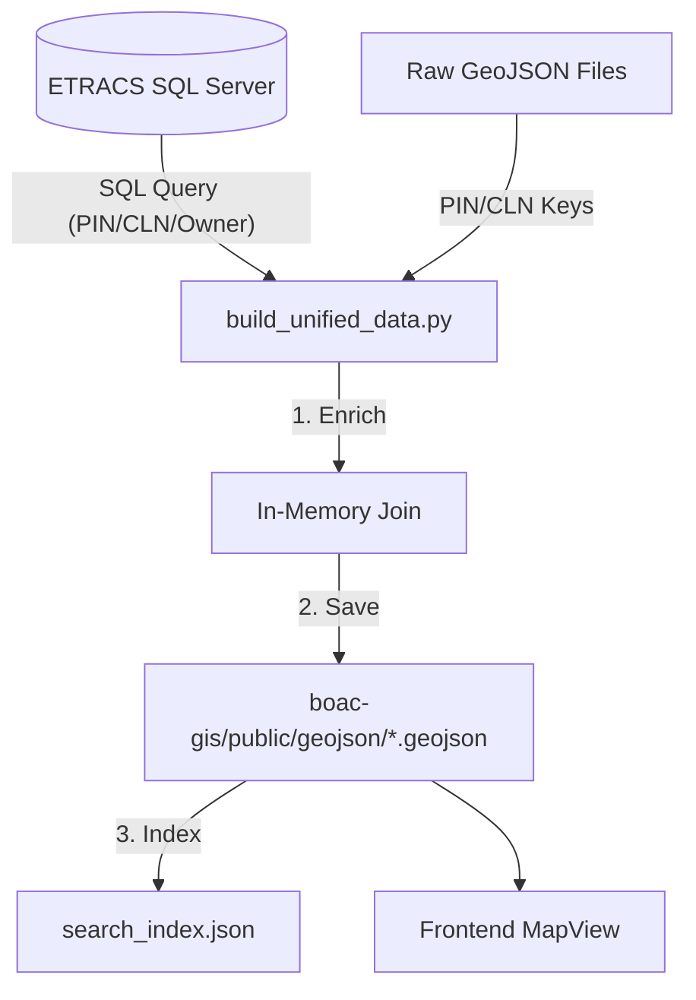

# Cadastral Data Architecture Reference

This document outlines the consolidated data architecture for the Boac Cadastral Map project. We have moved from a multi-step "spaghetti" pipeline to a unified, direct-connection architecture.

## Overview
The goal of this architectural change was to eliminate intermediate CSV files and redundant scripts, establishing the **ETRACS SQL Server** as the single source of truth for property ownership and classification data.

---

## 1. Previous Architecture (Spaghetti Logic)
Previously, the data was processed in three disconnected stages:
1.  **`extract_owner_name.py`**: Connected to DB and outputted `Cadastral_Data_WithOwner.csv`.
2.  **`enrich_geojson_owner.py`**: Read the CSV and modified GeoJSON files in the `output/` folder.
3.  **Manual Sync**: Files had to be manually copied or synced to the web application's `public/` directory.

---

## 2. New Consolidated Architecture
We now use a single unified script that handles the entire pipeline in one pass.

### The Unified Script: `build_unified_data.py`
This script acts as the "orchestrator." It performs three major actions:
1.  **Fetches Live Data**: Connects directly to the ETRACS SQL Server.
2.  **Enriches Shapes**: Matches the database records to GeoJSON shapes in memory.
3.  **Deploys Directly**: Writes the final, enriched GeoJSON files directly into the web app's `public/geojson/` folder.

### Data Flow Diagram


---

## 3. Data Connection Details

### The "Bridge" Keys
The data is connected using two specific fields found in both the GeoJSON properties and the SQL tables:
*   **`PIN`**: Property Identification Number.
*   **`CLN`**: Cadastral Lot Number (matches `cadastralLotNo` in DB).

### SQL Logic
The script uses the following SQL logic to build the ownership map:
*   **Table `RealProperty`**: The root for spatial identifiers (`pin`, `cadastralLotNo`).
*   **Table `RPU`**: Provides property classification (`classTitle`).
*   **Table `TaxDeclaration`**: Provides the official Tax Dec Number (`tdno`).
*   **Table `PropertyPayerLedger`**: Provides the `declaredOwnerName`.

**Prioritization Logic:** The script uses a `COALESCE` function to prioritize the `declaredOwnerName` from the Ledger, falling back to the `taxpayerName` from the Tax Declaration if the ledger record is missing.

---

## 4. Usage & Maintenance

### How to Update the Map
Whenever ownership changes in the ETRACS database, simply run the following command from the project root:
```powershell
python build_unified_data.py
```

### Script Tasks
The script automatically:
1.  Connects to the database configured in `server_config.env`.
2.  Builds a lookup map for all 30,000+ records.
3.  Processes all 70+ barangay GeoJSON files.
4.  Saves the updated files to the `boac-gis` web folder.
5.  Triggers `generate_search_index.py` to update the search bar.

### Required Dependencies
*   **Python 3.x**
*   **pyodbc**: `pip install pyodbc`
*   **ODBC Driver 17 for SQL Server** (Installed on the host machine).

---

## 5. Summary of Cleaned Files
The following files are now **obsolete** and can be removed/ignored to keep the workspace clean:
*   `extract_owner_name.py` (Replaced)
*   `enrich_geojson_owner.py` (Replaced)
*   `Cadastral_Data.csv` (No longer needed for mapping)
*   `Cadastral_Data_WithOwner.csv` (No longer needed)
