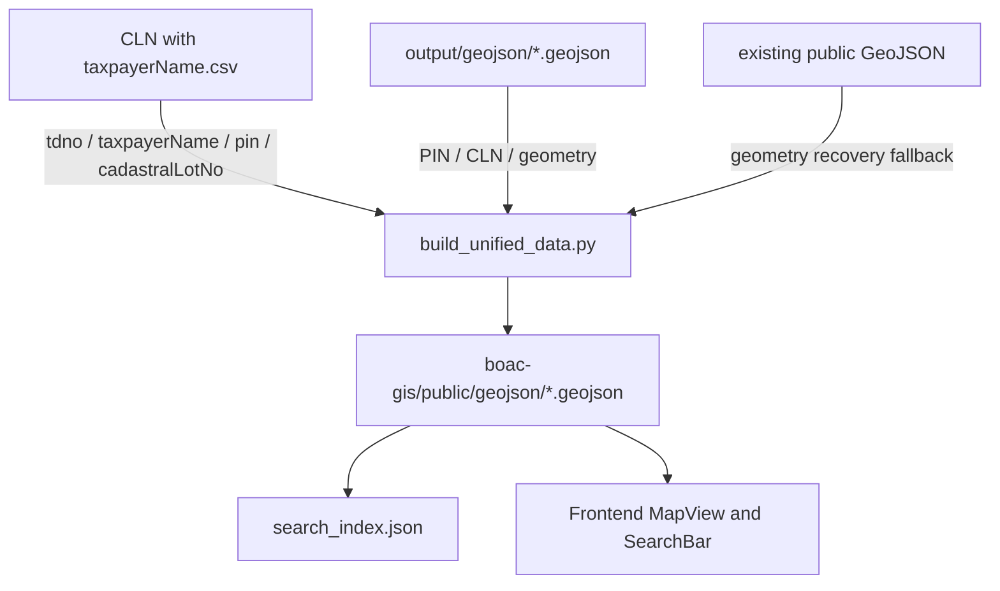

# Cadastral Data Architecture Reference

This project now uses static GeoJSON as the runtime source for map and search data. SQL Server is used only by the web app login system.

## Overview

The map should not query ETRACS while users search or browse lots. Taxpayer data is embedded ahead of time into the GeoJSON files from `CLN with taxpayerName.csv`.

## Data Pipeline

`build_unified_data.py` is the normal update command:

```powershell
python build_unified_data.py
```

It performs one offline pass:

1. Reads `CLN with taxpayerName.csv`.
2. Builds lookup maps by exact `pin` and by unambiguous normalized `cadastralLotNo`.
3. Reads source shapes from `output/geojson`.
4. Writes enriched files to `boac-gis/public/geojson`.
5. Regenerates `boac-gis/public/geojson/search_index.json`.



## Join Rules

- Primary key: exact `PIN` from GeoJSON to `pin` from the CSV.
- Conflicting duplicate CSV `pin` values are skipped so the system does not pick a last-row winner.
- Fallback key: normalized first token of GeoJSON `CLN` plus GeoJSON `Barangay` to CSV `cadastralLotNo` plus CSV `location`.
- CLN fallback is used only when that `(CLN, barangay)` pair maps to one taxpayer payload.
- Unsafe/unmatched owner fields are cleared so stale embedded names are not shown.

Embedded properties:

- `Owner` from CSV `taxpayerName`
- `TaxDecNo` from CSV `tdno`
- `Land_Class` from CSV `classTitle`

## Runtime SQL

The web runtime still uses SQL Server for authentication only:

- `dbo.gis_users` stores login users and scrypt password hashes.
- `boac-gis/lib/users.ts` reads and updates login rows.
- `boac-gis/scripts/setup-auth-db.mjs` creates or updates login users.

Map viewing, lot selection, and search use static files in `boac-gis/public/geojson`.

## Dependencies

Normal map data rebuild:

- Python 3.x
- No ETRACS connection
- No ODBC driver

Other legacy conversion scripts may still require their own GIS dependencies, such as `geopandas` and `pandas`.
